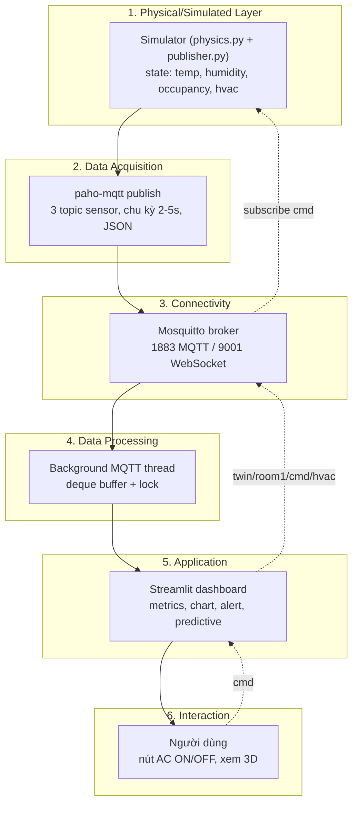

# Kiến trúc — Smart Lab Digital Twin

## Diagram 6 layer (mũi tên ngược = closed-loop)

## Technical Summary

**Vì sao MQTT thay vì CSV tĩnh / HTTP polling?** Pub/sub tách rời producer
và consumer: simulator không cần biết ai đang nghe, dashboard và trang 3D
cùng subscribe một nguồn dữ liệu mà không thêm tải cho simulator. MQTT nhẹ
(header vài byte), có sẵn retained message (client mới vào nhận ngay giá
trị cuối) và Last-Will (phát hiện simulator rớt mạng) — những thứ HTTP
polling phải tự xây. CSV tĩnh thì không có chiều real-time lẫn chiều điều
khiển ngược.

**Vì sao đây là digital twin, không chỉ digital shadow?** Shadow chỉ có
dòng dữ liệu 1 chiều sensor → dashboard. Hệ này đóng vòng lặp: dashboard
publish lệnh vào `twin/room1/cmd/hvac`, simulator đổi physics ngay bước
tiếp theo, và xác nhận qua `twin/room1/hvac/state` (retained) — dashboard
hiển thị trạng thái *được xác nhận*, không phải trạng thái đoán. Digital
model → shadow → twin khác nhau đúng ở mức độ tự động của 2 chiều dữ liệu;
chiều ngược tự động này là tiêu chí phân loại twin.
