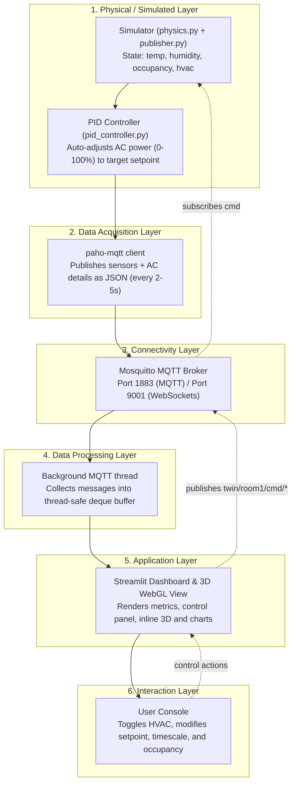

# Smart Lab Digital Twin Architecture

This document describes the design, components, and data flows of the Smart Lab Digital Twin.

---

## 6-Layer Architecture Diagram

---

## Technical Design & Strategy

### Why MQTT instead of Static CSV or REST Polling?
A real-time Digital Twin requires bidirectional event-driven communication. 
* **Decoupling**: The Simulator runs independently of who is listening. Both the Streamlit dashboard and the Three.js 3D viewport (running directly in the user's browser) subscribe to the same MQTT topics without imposing extra load on the simulator.
* **Low Latency & Overhead**: MQTT headers are lightweight (2 bytes), optimal for continuous telemetry.
* **LWT (Last Will and Testament)**: Enables the broker to publish an `offline` message if the simulator crashes or disconnects unexpectedly, notifying the dashboard instantly.
* **Retained Messages**: Newly connected clients (like a reopened browser page) instantly receive the latest state (temperature, occupancy, AC power) rather than waiting for the next publishing interval.

### Digital Twin vs. Digital Shadow
A *Digital Shadow* only flows one way (Physical $\rightarrow$ Digital). This project implements a full **Digital Twin** by closing the feedback loop. When a user changes the target setpoint or overrides occupancy on the dashboard, command messages are published to `/cmd` topics. The simulator reads these, recalculates the room state, and publishes the updated status back to `/state` and sensor topics. The dashboard displays the *confirmed* twin state returned by the simulator, ensuring synchronization.

### Closed-Loop AI Control (PID Controller)
The PID (Proportional-Integral-Derivative) controller acts as the automated brain of the HVAC system:
1. **Feedback Loop**: When the AC is active, it continuously measures the error ($e(t) = \text{Room Temperature} - \text{Setpoint}$).
2. **Gain Settings**:
   * **Proportional ($K_p = 0.40$)**: Instantly drives AC cooling power based on the size of the temperature deviation (100% cooling power at $\ge 2.5^\circ\text{C}$ error).
   * **Integral ($K_i = 0.05$)**: Aggregately accumulates residual error over time to eliminate steady-state offsets under heavy constant thermal loads.
   * **Derivative ($K_d = 0.05$)**: Dampens oscillations and limits overshoot as the temperature converges to the setpoint.
3. **Anti-Windup ($I_{max} = 20.0$)**: Prevents the integral term from accumulating indefinitely when the AC is running at max capacity, allowing rapid cooling recovery. The maximum contribution of the integral term is capped at $K_i \times I_{max} = 1.0$ (100% power) to fully compensate for extreme heat loads (such as 30 occupants producing 3000W).
4. **State Reset**: The controller's internal terms are reset to 0 when the HVAC is switched OFF to prevent windup during shutdown.
