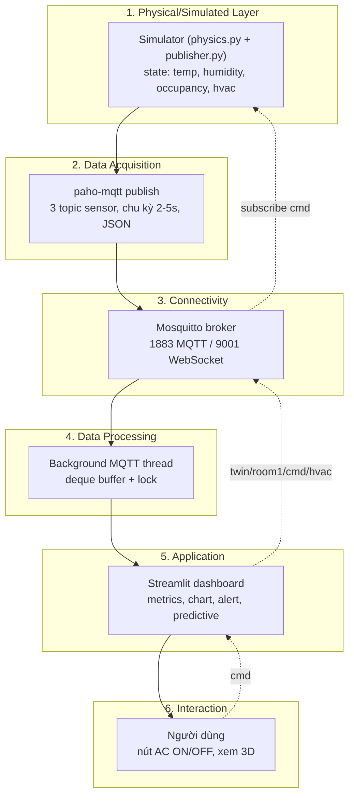

# Smart Lab Digital Twin — Implementation Plan

> **For agentic workers:** REQUIRED SUB-SKILL: Use superpowers:subagent-driven-development (recommended) or superpowers:executing-plans to implement this plan task-by-task. Steps use checkbox (`- [ ]`) syntax for tracking.

**Goal:** Digital twin của 1 phòng lab ảo: simulator vật lý publish sensor data qua MQTT, dashboard Streamlit hiển thị real-time và điều khiển ngược HVAC (closed-loop).

**Architecture:** Mosquitto broker (Docker) làm trung tâm pub/sub. Simulator Python giữ state vật lý (nhiệt/ẩm/occupancy/HVAC), publish 3 topic sensor theo chu kỳ riêng và subscribe topic lệnh. Dashboard Streamlit chạy 1 MQTT client duy nhất trong background thread (qua `st.cache_resource`), UI refresh bằng `st.fragment(run_every=...)`, bấm nút AC → publish lệnh → simulator đổi physics → số liệu phản ánh ngược lại dashboard.

**Tech Stack:** Docker + Eclipse Mosquitto 2.x, Python 3.10+, `paho-mqtt>=2.0` (Callback API VERSION2), Streamlit ≥1.37 (`st.fragment`), Plotly, NumPy, pytest. Module 5 optional: Three.js + mqtt.js qua WebSocket 9001.

## Global Constraints

- Repo root = thư mục project hiện tại (`Project-Simulation_01/`), cấu trúc thư mục con đúng theo spec: `mosquitto/config/`, `simulator/`, `dashboard/`, `room3d/`.
- Topic namespace cố định: `twin/room1/temperature|humidity|occupancy`, lệnh: `twin/room1/cmd/hvac`, bổ sung: `twin/room1/hvac/state` (retained), `twin/room1/status` (LWT), `twin/room1/cmd/occupancy` (demo).
- Payload sensor đúng format spec: `{"sensor": ..., "value": ..., "unit": ..., "timestamp": "<ISO8601 UTC, hậu tố Z>"}`.
- Chu kỳ publish: temperature 3s, humidity 5s, occupancy 2s. Ngưỡng alert: temp > 30°C (hysteresis tắt ở < 29.5°C), humidity < 20% hoặc > 70%, occupancy > 8.
- Physics: KHÔNG random thuần; nhiệt tăng 0.3–0.5°C mỗi 15s khi occupancy=8 (AC off), và giảm ≥ 2.5°C trong 90s sau khi bật AC — 2 mục tiêu này bị khóa bằng unit test.
- `paho-mqtt` phải dùng `mqtt.CallbackAPIVersion.VERSION2` (API v1 đã deprecated, chữ ký callback khác hẳn).
- Dashboard: đúng 1 MQTT client cho cả app (`@st.cache_resource`), KHÔNG tạo client mới mỗi rerun.
- Module 5 time-box tối đa 3–4 giờ; không xong → gỡ khỏi dashboard, không nhắc trong report.
- Commit sau mỗi task (repo được `git init` ở Task 1).

---

### Task 1: Scaffold repo + Broker (Module 1)

**Files:**
- Create: `.gitignore`
- Create: `docker-compose.yml`
- Create: `mosquitto/config/mosquitto.conf`
- Create: `simulator/requirements.txt`
- Create: `dashboard/requirements.txt`

**Interfaces:**
- Produces: broker chạy tại `localhost:1883` (MQTT) và `localhost:9001` (WebSocket), anonymous — mọi task sau kết nối vào đây.

- [ ] **Step 1: git init + .gitignore**

`.gitignore`:
```
__pycache__/
*.pyc
.venv/
venv/
.pytest_cache/
mosquitto/data/
mosquitto/log/
```

```bash
cd /Users/nguyentobinh12gmail.com/Downloads/Project-Simulation_01
git init
git add project_build_spec.md .gitignore docs/
git commit -m "chore: init repo with build spec and plan"
```

- [ ] **Step 2: Viết docker-compose.yml**

```yaml
services:
  mosquitto:
    image: eclipse-mosquitto:2
    container_name: mosquitto
    ports:
      - "1883:1883"
      - "9001:9001"
    volumes:
      - ./mosquitto/config/mosquitto.conf:/mosquitto/config/mosquitto.conf:ro
    restart: unless-stopped
```

- [ ] **Step 3: Viết mosquitto/config/mosquitto.conf**

Lưu ý thứ tự: `protocol websockets` phải đứng NGAY SAU `listener 9001` (directive áp cho listener khai báo gần nhất).

```
allow_anonymous true

listener 1883
protocol mqtt

listener 9001
protocol websockets
```

- [ ] **Step 4: Viết requirements**

`simulator/requirements.txt`:
```
paho-mqtt>=2.0,<3
```

`dashboard/requirements.txt`:
```
streamlit>=1.37
paho-mqtt>=2.0,<3
plotly>=5.20
numpy>=1.26
```

- [ ] **Step 5: Chạy broker và test pub/sub thủ công (Definition of done Module 1)**

```bash
docker compose up -d
docker exec mosquitto mosquitto_sub -t 'test/#' -C 1 -W 10 &
sleep 1
docker exec mosquitto mosquitto_pub -t test/hello -m 'ping'
wait
```
Expected: in ra `ping` rồi thoát (exit 0). Nếu timeout → check `docker logs mosquitto` (thường do sai thứ tự directive trong conf).

- [ ] **Step 6: Commit**

```bash
git add docker-compose.yml mosquitto/ simulator/requirements.txt dashboard/requirements.txt
git commit -m "feat: mosquitto broker on 1883 (mqtt) + 9001 (websocket)"
```

---

### Task 2: Physics model (Module 2, phần lõi) — TDD

**Files:**
- Create: `simulator/physics.py`
- Test: `simulator/tests/test_physics.py`
- Create: `simulator/tests/__init__.py` (file rỗng)

**Interfaces:**
- Produces: `RoomState` (dataclass: `temperature: float, humidity: float, occupancy: int, hvac_on: bool`), `step_temperature(state, dt) -> float`, `step_humidity(state, dt) -> float`, `step_occupancy(state, rng) -> int`, `clamp(v, lo, hi)`. Task 3 import các hàm này.

**Ghi chú tuning (sửa mâu thuẫn trong spec):** spec yêu cầu đồng thời (a) tăng 0.3–0.5°C/15s khi occupancy=8 và (b) hạ nhiệt về bình thường trong 60–90s sau khi bật AC, nhưng với Q_ac=-800W thì không tồn tại C thỏa cả hai. Giữ C=25000 J/°C (thỏa (a): 15×800/25000 ≈ 0.48°C) và nâng AC lên 1500W (thỏa (b): occupancy=3 → (300−1500)/25000 ≈ −0.048°C/s → ~3°C trong 63s). Humidity đổi sang rate/giây × dt cho khỏi phụ thuộc chu kỳ tick.

- [ ] **Step 1: Setup venv + pytest**

```bash
cd /Users/nguyentobinh12gmail.com/Downloads/Project-Simulation_01
python3 -m venv .venv && source .venv/bin/activate
pip install -r simulator/requirements.txt -r dashboard/requirements.txt pytest
```

- [ ] **Step 2: Viết test fail trước**

`simulator/tests/test_physics.py`:
```python
import random

from physics import RoomState, clamp, step_humidity, step_occupancy, step_temperature


def run_temp(state, seconds):
    t = state.temperature
    for _ in range(seconds):
        t = step_temperature(
            RoomState(temperature=t, humidity=state.humidity,
                      occupancy=state.occupancy, hvac_on=state.hvac_on),
            dt=1.0,
        )
    return t


def test_temp_rises_03_to_05_per_15s_when_full_room():
    # Mục tiêu spec: occupancy=8, AC off -> tăng 0.3-0.5°C mỗi 15s
    t_after = run_temp(RoomState(temperature=24.0, occupancy=8, hvac_on=False), 15)
    assert 0.3 <= t_after - 24.0 <= 0.5


def test_temp_drops_at_least_25_within_90s_when_ac_on():
    # Mục tiêu spec: bật AC -> về bình thường trong ~60-90s
    t_after = run_temp(RoomState(temperature=31.0, occupancy=3, hvac_on=True), 90)
    assert 31.0 - t_after >= 2.5


def test_hvac_flag_changes_direction_immediately():
    base = RoomState(temperature=26.0, occupancy=4, hvac_on=False)
    up = step_temperature(base, dt=1.0)
    down = step_temperature(RoomState(temperature=26.0, occupancy=4, hvac_on=True), dt=1.0)
    assert up > 26.0 and down < 26.0


def test_humidity_rises_with_people_and_clamps():
    s = RoomState(humidity=45.0, occupancy=6, hvac_on=False)
    assert step_humidity(s, dt=5.0) > 45.0
    high = RoomState(humidity=80.0, occupancy=10, hvac_on=False)
    assert step_humidity(high, dt=5.0) == 80.0  # clamp trần
    dry = RoomState(humidity=15.0, occupancy=0, hvac_on=True)
    assert step_humidity(dry, dt=5.0) == 15.0  # clamp sàn


def test_occupancy_random_walk_stays_in_bounds():
    rng = random.Random(42)
    occ = 5
    seen = set()
    for _ in range(500):
        s = RoomState(occupancy=occ)
        occ = step_occupancy(s, rng)
        seen.add(occ)
        assert 0 <= occ <= 10
    assert len(seen) > 1  # có biến thiên, không đứng yên


def test_clamp():
    assert clamp(5, 0, 10) == 5
    assert clamp(-1, 0, 10) == 0
    assert clamp(99, 0, 10) == 10
```

- [ ] **Step 3: Chạy test, xác nhận fail**

```bash
cd simulator && python -m pytest tests/ -v
```
Expected: FAIL — `ModuleNotFoundError: No module named 'physics'`.

- [ ] **Step 4: Viết simulator/physics.py**

```python
"""Mo hinh vat ly phong lab. Cac hang so duoc khoa boi tests/test_physics.py."""
import random
from dataclasses import dataclass

HEAT_PER_PERSON_W = 100.0     # moi nguoi toa ~100W
WALL_K = 0.05                 # truyen nhiet qua tuong (W/°C)
AC_POWER_W = 1500.0           # cong suat rut nhiet cua AC
ROOM_HEAT_CAPACITY = 25000.0  # J/°C
T_OUTDOOR = 32.0
HUMIDITY_PER_PERSON = 0.06    # %/s moi nguoi
AC_DRY_RATE = 0.5             # %/s khi AC bat

TEMP_MIN, TEMP_MAX = 15.0, 40.0
HUM_MIN, HUM_MAX = 15.0, 80.0
OCC_MIN, OCC_MAX = 0, 10


def clamp(v, lo, hi):
    return max(lo, min(hi, v))


@dataclass
class RoomState:
    temperature: float = 24.0
    humidity: float = 45.0
    occupancy: int = 2
    hvac_on: bool = False


def step_temperature(state: RoomState, dt: float) -> float:
    q_people = state.occupancy * HEAT_PER_PERSON_W
    q_outdoor = WALL_K * (T_OUTDOOR - state.temperature)
    q_ac = -AC_POWER_W if state.hvac_on else 0.0
    t_next = state.temperature + (dt / ROOM_HEAT_CAPACITY) * (q_people + q_outdoor + q_ac)
    return clamp(t_next, TEMP_MIN, TEMP_MAX)


def step_humidity(state: RoomState, dt: float) -> float:
    rate = state.occupancy * HUMIDITY_PER_PERSON - (AC_DRY_RATE if state.hvac_on else 0.0)
    return clamp(state.humidity + rate * dt, HUM_MIN, HUM_MAX)


def step_occupancy(state: RoomState, rng: random.Random) -> int:
    delta = rng.choice([-1, 0, 0, 1])  # thien ve dung yen cho tu nhien
    return clamp(state.occupancy + delta, OCC_MIN, OCC_MAX)
```

- [ ] **Step 5: Chạy test, xác nhận pass**

```bash
cd simulator && python -m pytest tests/ -v
```
Expected: 6 passed.

- [ ] **Step 6: Commit**

```bash
git add simulator/physics.py simulator/tests/
git commit -m "feat: physics model with rate targets locked by tests"
```

---

### Task 3: Publisher + closed-loop subscribe (Module 2, hoàn chỉnh)

**Files:**
- Create: `simulator/publisher.py`
- Test: `simulator/tests/test_publisher.py`

**Interfaces:**
- Consumes: `physics.RoomState`, `step_temperature/step_humidity/step_occupancy`.
- Produces: publish `twin/room1/{temperature,humidity,occupancy}` (retained, đúng payload spec); `twin/room1/hvac/state` retained `{"hvac_on": bool, "timestamp": ...}`; LWT `twin/room1/status` = `"offline"`, khi connect publish `"online"` (retained). Subscribe `twin/room1/cmd/hvac` (`{"command":"on"|"off"}`) và `twin/room1/cmd/occupancy` (`{"value": <int>}` — ép occupancy để demo). Hàm testable: `make_payload(sensor, value, unit, timestamp=None) -> str`, `handle_command(state, topic, payload_bytes) -> RoomState`.

- [ ] **Step 1: Viết test fail trước**

`simulator/tests/test_publisher.py`:
```python
import json

from physics import RoomState
from publisher import CMD_HVAC, CMD_OCCUPANCY, handle_command, make_payload


def test_make_payload_matches_spec_format():
    p = json.loads(make_payload("temperature", 24.7, "C", "2026-07-16T20:14:03Z"))
    assert p == {"sensor": "temperature", "value": 24.7, "unit": "C",
                 "timestamp": "2026-07-16T20:14:03Z"}


def test_make_payload_default_timestamp_is_utc_iso_z():
    p = json.loads(make_payload("humidity", 45.2, "%"))
    assert p["timestamp"].endswith("Z") and "T" in p["timestamp"]


def test_hvac_command_on_off():
    s = RoomState(hvac_on=False)
    s2 = handle_command(s, CMD_HVAC, b'{"command": "on"}')
    assert s2.hvac_on is True
    s3 = handle_command(s2, CMD_HVAC, b'{"command": "off"}')
    assert s3.hvac_on is False


def test_occupancy_override_clamped():
    s = handle_command(RoomState(), CMD_OCCUPANCY, b'{"value": 8}')
    assert s.occupancy == 8
    s = handle_command(RoomState(), CMD_OCCUPANCY, b'{"value": 99}')
    assert s.occupancy == 10


def test_malformed_command_is_ignored():
    s = RoomState(hvac_on=True)
    assert handle_command(s, CMD_HVAC, b"not json").hvac_on is True
    assert handle_command(s, CMD_HVAC, b'{"command": "banana"}').hvac_on is True
```

Run: `cd simulator && python -m pytest tests/test_publisher.py -v` — Expected: FAIL (`No module named 'publisher'`).

- [ ] **Step 2: Viết simulator/publisher.py**

```python
"""Simulator: publish sensor data va nhan lenh dieu khien nguoc (closed-loop)."""
import json
import random
import time
from dataclasses import replace
from datetime import datetime, timezone

import paho.mqtt.client as mqtt

from physics import (OCC_MAX, OCC_MIN, RoomState, clamp, step_humidity,
                     step_occupancy, step_temperature)

BROKER_HOST = "localhost"
BROKER_PORT = 1883
BASE = "twin/room1"
CMD_HVAC = f"{BASE}/cmd/hvac"
CMD_OCCUPANCY = f"{BASE}/cmd/occupancy"
STATUS_TOPIC = f"{BASE}/status"
HVAC_STATE_TOPIC = f"{BASE}/hvac/state"

INTERVALS = {"temperature": 3, "humidity": 5, "occupancy": 2}
NOISE = 0.1


def utc_now_iso() -> str:
    return datetime.now(timezone.utc).strftime("%Y-%m-%dT%H:%M:%SZ")


def make_payload(sensor: str, value, unit: str, timestamp: str | None = None) -> str:
    return json.dumps({"sensor": sensor, "value": value, "unit": unit,
                       "timestamp": timestamp or utc_now_iso()})


def handle_command(state: RoomState, topic: str, payload: bytes) -> RoomState:
    """Ap lenh dieu khien vao state; lenh hong thi bo qua, state giu nguyen."""
    try:
        data = json.loads(payload)
    except (json.JSONDecodeError, UnicodeDecodeError):
        return state
    if topic == CMD_HVAC:
        cmd = data.get("command")
        if cmd in ("on", "off"):
            return replace(state, hvac_on=(cmd == "on"))
    elif topic == CMD_OCCUPANCY:
        v = data.get("value")
        if isinstance(v, int):
            return replace(state, occupancy=clamp(v, OCC_MIN, OCC_MAX))
    return state


class Simulator:
    def __init__(self):
        self.state = RoomState()
        self.rng = random.Random()
        self.client = mqtt.Client(mqtt.CallbackAPIVersion.VERSION2)
        self.client.will_set(STATUS_TOPIC, "offline", retain=True)
        self.client.on_connect = self.on_connect
        self.client.on_message = self.on_message

    def on_connect(self, client, userdata, flags, reason_code, properties):
        client.subscribe([(CMD_HVAC, 0), (CMD_OCCUPANCY, 0)])
        client.publish(STATUS_TOPIC, "online", retain=True)
        self.publish_hvac_state()
        print("connected, subscribed to cmd topics")

    def on_message(self, client, userdata, msg):
        before = self.state.hvac_on
        self.state = handle_command(self.state, msg.topic, msg.payload)
        print(f"cmd {msg.topic}: {msg.payload!r} -> hvac_on={self.state.hvac_on}, "
              f"occupancy={self.state.occupancy}")
        if self.state.hvac_on != before:
            self.publish_hvac_state()

    def publish_hvac_state(self):
        self.client.publish(HVAC_STATE_TOPIC,
                            json.dumps({"hvac_on": self.state.hvac_on,
                                        "timestamp": utc_now_iso()}),
                            retain=True)

    def publish_sensor(self, sensor: str):
        if sensor == "temperature":
            value, unit = round(self.state.temperature + self.rng.uniform(-NOISE, NOISE), 2), "C"
        elif sensor == "humidity":
            value, unit = round(self.state.humidity + self.rng.uniform(-NOISE, NOISE), 2), "%"
        else:
            value, unit = self.state.occupancy, "people"
        self.client.publish(f"{BASE}/{sensor}", make_payload(sensor, value, unit), retain=True)
        print(f"{sensor}={value}{unit} hvac={'on' if self.state.hvac_on else 'off'}")

    def run(self):
        self.client.connect(BROKER_HOST, BROKER_PORT)
        self.client.loop_start()  # cmd xu ly o thread rieng cua paho
        tick = 0
        try:
            while True:
                # physics tien 1 giay moi tick, khong phu thuoc chu ky publish
                self.state = replace(
                    self.state,
                    temperature=step_temperature(self.state, dt=1.0),
                    humidity=step_humidity(self.state, dt=1.0),
                )
                if tick % INTERVALS["occupancy"] == 0:
                    self.state = replace(self.state,
                                         occupancy=step_occupancy(self.state, self.rng))
                for sensor, interval in INTERVALS.items():
                    if tick % interval == 0:
                        self.publish_sensor(sensor)
                tick += 1
                time.sleep(1)
        except KeyboardInterrupt:
            self.client.publish(STATUS_TOPIC, "offline", retain=True)
            self.client.loop_stop()


if __name__ == "__main__":
    Simulator().run()
```

- [ ] **Step 3: Chạy test, xác nhận pass**

```bash
cd simulator && python -m pytest tests/ -v
```
Expected: 11 passed.

- [ ] **Step 4: Kiểm tra thủ công closed-loop (Definition of done Module 2)**

Terminal 1: `cd simulator && python publisher.py` — thấy log 3 sensor đúng chu kỳ.

Terminal 2:
```bash
docker exec mosquitto mosquitto_sub -t 'twin/#' -v -C 5   # thay format JSON dung spec
docker exec mosquitto mosquitto_pub -t twin/room1/cmd/occupancy -m '{"value": 8}'
# doi ~30s, log temperature tang dan ~0.03°C/s
docker exec mosquitto mosquitto_pub -t twin/room1/cmd/hvac -m '{"command": "on"}'
# log hvac=on, temperature bat dau giam trong vai buoc tiep theo
```
Expected: temp tăng khi occupancy=8, giảm sau lệnh `on`.

- [ ] **Step 5: Commit**

```bash
git add simulator/publisher.py simulator/tests/test_publisher.py
git commit -m "feat: mqtt publisher with closed-loop hvac + occupancy override"
```

---

### Task 4: Dashboard Tier 1 (Module 3)

**Files:**
- Create: `dashboard/app.py`

**Interfaces:**
- Consumes: các topic Task 3 (payload JSON spec; `twin/room1/hvac/state`; `twin/room1/status`).
- Produces: `get_mqtt() -> tuple[mqtt.Client, dict]` với store `{"temperature": deque[(datetime, float)], "humidity": deque, "occupancy": deque, "hvac_on": bool|None, "status": str, "lock": threading.Lock}` — Task 5 mở rộng file này.

- [ ] **Step 1: Viết dashboard/app.py**

```python
"""Dashboard Streamlit: hien thi real-time + dieu khien AC (Task 5)."""
import json
import threading
from collections import deque
from datetime import datetime

import paho.mqtt.client as mqtt
import plotly.graph_objects as go
import streamlit as st

BROKER_HOST = "localhost"
BROKER_PORT = 1883
BASE = "twin/room1"
SENSORS = ("temperature", "humidity", "occupancy")
ALERT_ON, ALERT_OFF = 30.0, 29.5  # hysteresis chong nhap nhay


@st.cache_resource
def get_mqtt():
    """1 client + 1 buffer duy nhat cho ca app — song sot qua moi lan rerun."""
    store = {
        "temperature": deque(maxlen=100),  # ~5 phut @ 3s
        "humidity": deque(maxlen=60),
        "occupancy": deque(maxlen=150),
        "hvac_on": None,
        "status": "unknown",
        "lock": threading.Lock(),
    }

    def on_connect(client, userdata, flags, reason_code, properties):
        client.subscribe([(f"{BASE}/{s}", 0) for s in SENSORS]
                         + [(f"{BASE}/hvac/state", 0), (f"{BASE}/status", 0)])

    def on_message(client, userdata, msg):
        with store["lock"]:
            if msg.topic == f"{BASE}/status":
                store["status"] = msg.payload.decode()
                return
            try:
                data = json.loads(msg.payload)
            except json.JSONDecodeError:
                return
            if msg.topic == f"{BASE}/hvac/state":
                store["hvac_on"] = data.get("hvac_on")
            else:
                sensor = msg.topic.rsplit("/", 1)[-1]
                ts = datetime.fromisoformat(data["timestamp"].replace("Z", "+00:00"))
                store[sensor].append((ts, data["value"]))

    client = mqtt.Client(mqtt.CallbackAPIVersion.VERSION2)
    client.on_connect = on_connect
    client.on_message = on_message
    client.connect(BROKER_HOST, BROKER_PORT)
    client.loop_start()
    return client, store


def latest(store, sensor):
    with store["lock"]:
        return store[sensor][-1][1] if store[sensor] else None


st.set_page_config(page_title="Smart Lab Digital Twin", layout="wide")
st.title("Smart Lab Digital Twin — Room 1")
client, store = get_mqtt()
if "alert_on" not in st.session_state:
    st.session_state.alert_on = False


@st.fragment(run_every=1.0)
def live_view():
    temp = latest(store, "temperature")
    hum = latest(store, "humidity")
    occ = latest(store, "occupancy")

    if store["status"] == "offline":
        st.warning("Simulator offline — dữ liệu bên dưới là giá trị cuối cùng.")

    # Alert banner voi hysteresis
    if temp is not None:
        if temp > ALERT_ON:
            st.session_state.alert_on = True
        elif temp < ALERT_OFF:
            st.session_state.alert_on = False
    if st.session_state.alert_on:
        st.error(f"🔥 QUÁ NHIỆT: {temp:.1f}°C (ngưỡng {ALERT_ON}°C)")

    c1, c2, c3 = st.columns(3)
    c1.metric("🌡 Temperature", f"{temp:.1f} °C" if temp is not None else "—")
    c2.metric("💧 Humidity", f"{hum:.1f} %" if hum is not None else "—")
    c3.metric("👥 Occupancy", f"{occ} người" if occ is not None else "—")

    with store["lock"]:
        points = list(store["temperature"])
    if points:
        xs, ys = zip(*points)
        fig = go.Figure(go.Scatter(x=list(xs), y=list(ys), mode="lines"))
        fig.add_hline(y=ALERT_ON, line_dash="dash", line_color="red",
                      annotation_text="ngưỡng alert 30°C")
        fig.update_layout(height=320, margin=dict(l=10, r=10, t=30, b=10),
                          yaxis_title="°C", title="Nhiệt độ (~5 phút gần nhất)")
        st.plotly_chart(fig, use_container_width=True)
    else:
        st.info("Đang chờ dữ liệu từ simulator…")


live_view()
```

- [ ] **Step 2: Kiểm tra thủ công (Definition of done Module 3 Tier 1)**

```bash
docker compose up -d
# Terminal 1
cd simulator && python publisher.py
# Terminal 2
cd dashboard && streamlit run app.py
```
Expected: 3 metric card update mỗi giây, chart chạy, không lag. Kích hoạt alert:
```bash
docker exec mosquitto mosquitto_pub -t twin/room1/cmd/occupancy -m '{"value": 10}'
```
Đợi temp vượt 30°C → banner đỏ hiện; publish `{"command":"on"}` vào cmd/hvac → temp hạ dưới 29.5°C → banner tự ẩn. Check duplicate connection: `docker logs mosquitto | grep -c "new client"` không tăng khi refresh trang dashboard nhiều lần.

- [ ] **Step 3: Commit**

```bash
git add dashboard/app.py
git commit -m "feat: streamlit dashboard tier 1 - live metrics, chart, alert with hysteresis"
```

---

### Task 5: Dashboard Tier 2 — điều khiển AC + predictive alert (Module 3)

**Files:**
- Modify: `dashboard/app.py` (thêm sidebar control + predictive vào `live_view`)

**Interfaces:**
- Consumes: `client.publish(f"{BASE}/cmd/hvac", ...)`; `store["hvac_on"]` (trạng thái THẬT từ simulator, không phải trạng thái đoán sau khi bấm nút).

- [ ] **Step 1: Thêm khối điều khiển AC (đặt sau `client, store = get_mqtt()`, trước `live_view`)**

```python
with st.sidebar:
    st.header("Điều khiển")
    col_on, col_off = st.columns(2)
    if col_on.button("❄️ AC ON", use_container_width=True):
        client.publish(f"{BASE}/cmd/hvac", json.dumps({"command": "on"}))
    if col_off.button("AC OFF", use_container_width=True):
        client.publish(f"{BASE}/cmd/hvac", json.dumps({"command": "off"}))
    st.caption("Trạng thái AC lấy từ twin/room1/hvac/state — "
               "là trạng thái simulator xác nhận, không phải trạng thái nút.")
```

- [ ] **Step 2: Hiển thị trạng thái AC trong `live_view` (thêm sau 3 metric card)**

```python
    hvac = store["hvac_on"]
    if hvac is None:
        st.caption("AC: chưa rõ (chưa nhận state)")
    else:
        st.markdown(f"**AC:** {'🟢 ON' if hvac else '⚪ OFF'}")
```

- [ ] **Step 3: Predictive alert (thêm cuối `live_view`, cần `import numpy as np` và `from datetime import timezone` đầu file)**

```python
    # Du bao: fit bac 1 qua 60s gan nhat, uoc luong thoi gian cham 30°C
    if len(points) >= 5:
        now = xs[-1]
        recent = [(x, y) for x, y in points if (now - x).total_seconds() <= 60]
        if len(recent) >= 5:
            t0 = recent[0][0]
            sec = np.array([(x - t0).total_seconds() for x, _ in recent])
            vals = np.array([y for _, y in recent])
            slope, intercept = np.polyfit(sec, vals, 1)
            if slope > 0.001 and vals[-1] < ALERT_ON:
                eta = (ALERT_ON - vals[-1]) / slope
                if eta < 300:
                    st.warning(f"📈 Dự báo chạm {ALERT_ON}°C sau ~{eta:.0f}s "
                               f"(tốc độ +{slope*60:.2f}°C/phút)")
```

- [ ] **Step 4: Kiểm tra thủ công vòng lặp kín (Definition of done Module 3 Tier 2)**

Chạy simulator + dashboard. Ép occupancy=10 → thấy predictive warning trước, rồi alert đỏ. Bấm **AC ON** trên dashboard → trong ≤2s trạng thái AC chuyển 🟢 ON (do simulator xác nhận qua hvac/state), temp bắt đầu giảm, alert tự tắt dưới 29.5°C. Bấm **AC OFF** → ⚪ OFF, temp tăng lại.

- [ ] **Step 5: Commit**

```bash
git add dashboard/app.py
git commit -m "feat: dashboard tier 2 - AC control, acknowledged hvac state, predictive alert"
```

---

### Task 6: Architecture diagram + Technical summary + README (Module 4)

**Files:**
- Create: `docs/architecture.md`
- Create: `README.md`

- [ ] **Step 1: Viết docs/architecture.md**

````markdown
# Kiến trúc — Smart Lab Digital Twin

## Diagram 6 layer (mũi tên ngược = closed-loop)



## Technical Summary

**Vì sao MQTT thay vì CSV tĩnh / HTTP polling?** Pub/sub tách rời producer
và consumer: simulator không cần biết ai đang nghe, dashboard và trang 3D
cùng subscribe một nguồn dữ liệu mà không thêm tải cho simulator. MQTT nhẹ
(header vài byte), có sẵn retained message (client mới vào nhận ngay giá
trị cuối) và Last-Will (phát hiện simulator rớt mạng) — những thứ HTTP
polling phải tự xây. CSV tĩnh thì không có chiều real-time lẫn chiều điều
khiển ngược.

**Vì sao đây là digital twin, không chỉ digital shadow?** Shadow chỉ có
dòng dữ liệu 1 chiều sensor → dashboard. Hệ này đóng vòng lặp: dashboard
publish lệnh vào `twin/room1/cmd/hvac`, simulator đổi physics ngay bước
tiếp theo, và xác nhận qua `twin/room1/hvac/state` (retained) — dashboard
hiển thị trạng thái *được xác nhận*, không phải trạng thái đoán. Digital
model → shadow → twin khác nhau đúng ở mức độ tự động của 2 chiều dữ liệu;
chiều ngược tự động này là tiêu chí phân loại twin.
````

- [ ] **Step 2: Viết README.md**

````markdown
# Smart Lab Digital Twin

Digital twin của 1 phòng lab ảo: simulator vật lý → MQTT → dashboard
real-time, kèm điều khiển ngược HVAC (closed-loop). Kiến trúc chi tiết:
[docs/architecture.md](docs/architecture.md).

## Chạy

```bash
docker compose up -d                       # broker :1883 + :9001
python3 -m venv .venv && source .venv/bin/activate
pip install -r simulator/requirements.txt -r dashboard/requirements.txt

python simulator/publisher.py              # terminal 1
streamlit run dashboard/app.py             # terminal 2
```

## Demo script

```bash
# Ép phòng đông người -> nhiệt tăng, predictive alert, rồi alert đỏ
docker exec mosquitto mosquitto_pub -t twin/room1/cmd/occupancy -m '{"value": 10}'
# Bấm "AC ON" trên dashboard (hoặc:)
docker exec mosquitto mosquitto_pub -t twin/room1/cmd/hvac -m '{"command": "on"}'
```

## Topics

| Topic | Chiều | Nội dung |
|---|---|---|
| `twin/room1/temperature` | sim → dash | `{"sensor","value","unit","timestamp"}`, 3s, retained |
| `twin/room1/humidity` | sim → dash | như trên, 5s |
| `twin/room1/occupancy` | sim → dash | như trên, 2s |
| `twin/room1/cmd/hvac` | dash → sim | `{"command": "on"\|"off"}` |
| `twin/room1/cmd/occupancy` | demo → sim | `{"value": <int 0-10>}` |
| `twin/room1/hvac/state` | sim → dash | trạng thái AC xác nhận, retained |
| `twin/room1/status` | sim → dash | `online`/`offline` (LWT), retained |

## Test

```bash
cd simulator && python -m pytest tests/ -v
```
````

- [ ] **Step 3: Commit**

```bash
git add docs/architecture.md README.md
git commit -m "docs: architecture diagram, technical summary, README"
```

---

### Task 7 (OPTIONAL, time-box 3–4h): 3D Visualization (Module 5)

**Điều kiện vào task:** Task 3–5 chạy ổn. Hết time-box mà chưa mượt → `git checkout -- .`, gỡ khỏi dashboard, không nhắc trong report.

**Files:**
- Create: `room3d/vendor/three.module.js`, `room3d/vendor/mqtt.min.js` (tải 1 lần)
- Create: `room3d/room3d.html`
- Modify: `dashboard/app.py` (nhúng iframe — chuỗi HTML tĩnh, KHÔNG f-string)

- [ ] **Step 0: Vendor thư viện về local** (thay vì load CDN lúc chạy — tránh rủi ro CDN bị thay đổi nội dung/không có SRI, và demo được khi offline; vẫn "không build step" đúng tinh thần spec)

```bash
mkdir -p room3d/vendor
curl -fsSL https://unpkg.com/three@0.160.0/build/three.module.js -o room3d/vendor/three.module.js
curl -fsSL https://unpkg.com/mqtt@5/dist/mqtt.min.js -o room3d/vendor/mqtt.min.js
```

- [ ] **Step 1: Viết room3d/room3d.html**

```html
<!DOCTYPE html>
<html>
<head>
<meta charset="utf-8">
<style>body{margin:0;overflow:hidden;background:#111}#hud{position:fixed;top:8px;left:8px;color:#eee;font:13px monospace}</style>
</head>
<body>
<div id="hud">connecting…</div>
<script src="vendor/mqtt.min.js"></script>
<script type="module">
import * as THREE from './vendor/three.module.js';

const scene = new THREE.Scene();
const camera = new THREE.PerspectiveCamera(60, innerWidth/innerHeight, 0.1, 100);
camera.position.set(6, 6, 8); camera.lookAt(0, 1, 0);
const renderer = new THREE.WebGLRenderer({antialias: true});
renderer.setSize(innerWidth, innerHeight);
document.body.appendChild(renderer.domElement);
scene.add(new THREE.AmbientLight(0xffffff, 0.6));
const sun = new THREE.DirectionalLight(0xffffff, 1); sun.position.set(5, 10, 5); scene.add(sun);

// San: lerp mau theo nhiet do 20°C (xanh) -> 32°C (do)
const floorMat = new THREE.MeshStandardMaterial({color: 0x2266ff});
scene.add(new THREE.Mesh(new THREE.BoxGeometry(8, 0.2, 6), floorMat));
// 4 tuong mo
const wallMat = new THREE.MeshStandardMaterial({color: 0x8899aa, transparent: true, opacity: 0.25});
[[0,1.5,-3,8,3,0.1],[0,1.5,3,8,3,0.1],[-4,1.5,0,0.1,3,6],[4,1.5,0,0.1,3,6]]
  .forEach(([x,y,z,w,h,d]) => {
    const wall = new THREE.Mesh(new THREE.BoxGeometry(w,h,d), wallMat);
    wall.position.set(x,y,z); scene.add(wall);
  });
// Quat AC tren tran
const fan = new THREE.Mesh(new THREE.BoxGeometry(1.6, 0.05, 0.2),
                           new THREE.MeshStandardMaterial({color: 0xffffff}));
fan.position.set(0, 2.8, 0); scene.add(fan);

let people = [];
const personGeo = new THREE.CapsuleGeometry(0.2, 0.8, 4, 8);
const personMat = new THREE.MeshStandardMaterial({color: 0xffcc66});
function setPeople(n) {
  people.forEach(p => scene.remove(p)); people = [];
  for (let i = 0; i < n; i++) {
    const p = new THREE.Mesh(personGeo, personMat);
    p.position.set(-3 + (i % 4) * 2, 0.8, -1.5 + Math.floor(i / 4) * 2);
    scene.add(p); people.push(p);
  }
}

let temp = 24, hvacOn = false, occ = 0;
const hud = document.getElementById('hud');
const client = mqtt.connect('ws://localhost:9001');
client.on('connect', () => client.subscribe(['twin/room1/temperature', 'twin/room1/occupancy', 'twin/room1/hvac/state']));
client.on('message', (topic, payload) => {
  const d = JSON.parse(payload.toString());
  if (topic.endsWith('/temperature')) temp = d.value;
  else if (topic.endsWith('/occupancy')) { occ = d.value; setPeople(occ); }
  else if (topic.endsWith('/state')) hvacOn = d.hvac_on;
  hud.textContent = `${temp.toFixed(1)}°C | ${occ} người | AC ${hvacOn ? 'ON' : 'OFF'}`;
});

const cold = new THREE.Color(0x2266ff), hot = new THREE.Color(0xff3322);
const clock = new THREE.Clock();
function animate() {
  requestAnimationFrame(animate);
  const k = Math.min(Math.max((temp - 20) / 12, 0), 1);  // 20->32°C
  floorMat.color.copy(cold).lerp(hot, k);
  if (hvacOn) fan.rotation.y += clock.getDelta() * 6; else clock.getDelta();
  renderer.render(scene, camera);
}
animate();
</script>
</body>
</html>
```

- [ ] **Step 2: Test standalone trước khi nhúng**

ES module import bị chặn khi mở bằng `file://` (CORS) — phải serve qua HTTP:

```bash
python -m http.server 8000 --directory room3d &
open http://localhost:8000/room3d.html   # simulator + broker dang chay
```
Expected: sàn đổi màu theo nhiệt, capsule = số người, quạt quay khi AC on.

- [ ] **Step 3: Nhúng vào dashboard (cuối app.py)**

Dùng `iframe(url)` chứ không phải `html(chuỗi)` — chuỗi srcdoc sẽ làm hỏng đường dẫn `vendor/` tương đối; URL tĩnh cũng tránh iframe reload mỗi lần rerun (đúng cảnh báo trong spec):

```python
# Can `python -m http.server 8000 --directory room3d` chay kem (ghi vao README)
with st.expander("🧊 3D Room View", expanded=False):
    st.components.v1.iframe("http://localhost:8000/room3d.html", height=500)
```

Thêm vào README phần Chạy: `python -m http.server 8000 --directory room3d  # terminal 3, chỉ cần cho 3D view`.

- [ ] **Step 4: Kiểm tra iframe không reload khi metrics update (chart vẫn chạy mượt trong 1 phút), rồi commit**

```bash
git add room3d/room3d.html dashboard/app.py
git commit -m "feat: optional three.js 3d room view over websocket mqtt"
```

---

## Self-review đã chạy

- **Spec coverage:** Module 1→Task 1, Module 2→Task 2+3, Module 3 Tier1→Task 4, Tier2→Task 5, Module 4→Task 6, Module 5→Task 7. DoD của từng module được map vào step kiểm tra thủ công tương ứng. ✓
- **Sai lệch có chủ đích so với spec (đã ghi lý do):** AC 800W→1500W (spec tự mâu thuẫn về tốc độ hạ nhiệt), humidity đổi sang rate/giây, thêm 3 topic (`hvac/state`, `status`, `cmd/occupancy`), alert có hysteresis.
- **Type consistency:** `RoomState`/`step_*`/`clamp` (Task 2) khớp import ở Task 3; `make_payload`/`handle_command`/`CMD_*` khớp giữa test và code; store schema Task 4 khớp phần mở rộng Task 5. ✓
